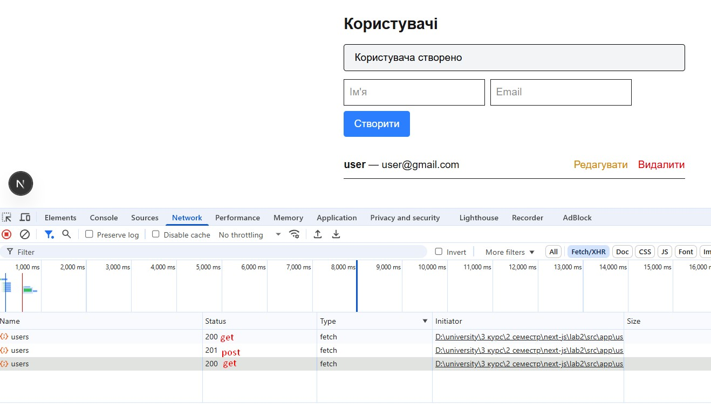

**скріншоти на ходу виконання лабораторної роботи**

**завдання 1_3 Вивести змінні браузер та консоль**

**завдання 2_4 Вивести логи підключення до бази даних**

**завдання 3_4 Вивести результати з dev бази даних**

**завдання 4_4 Результати CRUD з фронтенду**

**get**

**create**

**edit**

**delete**

**завдання 4_4 Результати CRUD з postman**

**get**

**create**

**edit**

**delete**
